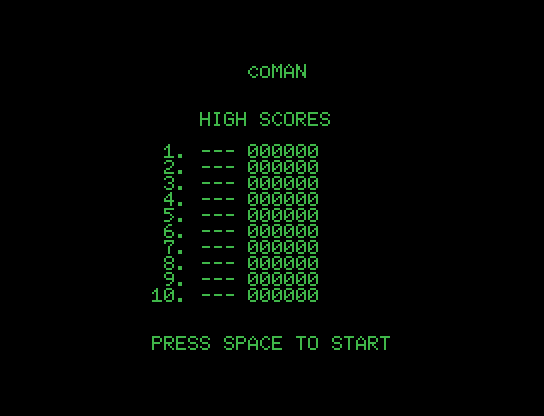
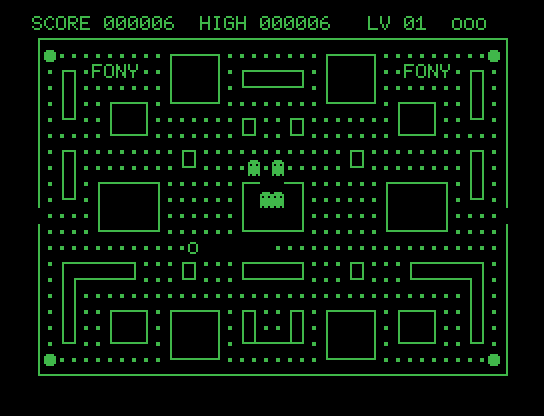
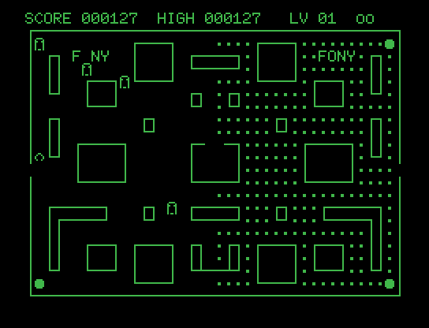

# C0MAN

A Pac-Man-style game for unexpanded MSX1, running entirely in SCREEN 0
(WIDTH 40) — no sprites, no per-cell color, just redefined text
characters. Plain 16KB ROM cartridge, no mapper.

▶ **[Play it online](https://www.file-hunter.com/Homebrew/?id=c0man)**

## Screenshots

| Title screen | Fresh game | Mid-game |
|---|---|---|
|  |  |  |

## Building

Requires [sjasmplus](https://github.com/z00m128/sjasmplus). From the
project root:

```
build.bat
```

produces `c0man.rom`.

## Credits

This project is an experiment in human/AI collaboration between
**Arnaud de Klerk** and **Claude** (Anthropic) — the whole game, from
first line of code to the final build, was written in a few hours.
